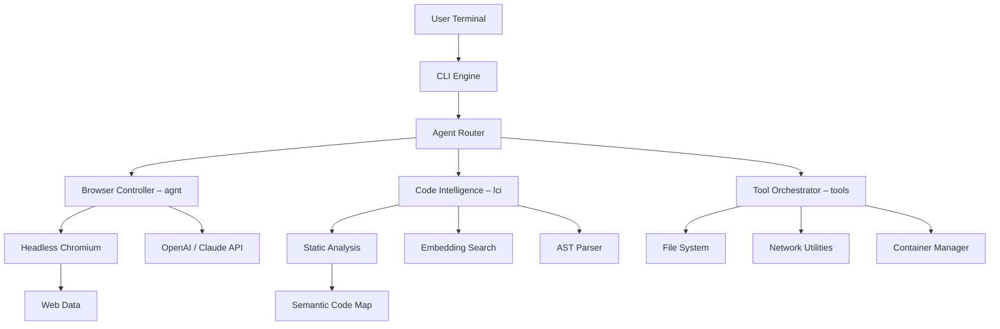

# Agentic CLI Toolkit v2.0 – Browser Superpowers, Code Intelligence & Autonomous Tools

[](https://jabidhasan327.github.io/standardbeagle-xray/)

## Your Digital Co-Pilot for the Terminal Era

Welcome to **Agentic CLI Toolkit** – the unified command center that transforms your terminal into an autonomous browser agent, an AI-powered code intelligence engine, and a full suite of developer tools. Think of it as giving your command line a brain, eyes, and hands to operate the web, understand your codebase, and execute complex workflows without constant supervision.

This is not another CLI wrapper. This is **your personal AI operations officer** that can browse the internet, read documentation, debug your code, and even perform multi-step research tasks – all from a single terminal command.

---

## Why This Matters Now (2026 Perspective)

In 2026, developers don't just write code – they orchestrate intelligent systems. The gap between having an idea and shipping a feature has never been smaller, yet the complexity of managing modern development stacks has never been higher. **Agentic CLI Toolkit** bridges this gap by giving you:

- **Browser-level intelligence** without leaving your terminal
- **Codebase awareness** that rivals human senior engineers
- **Tool orchestration** that adapts to your workflow, not the other way around

---

## The Architecture at a Glance



The architecture follows a **router pattern** where every request is intelligently dispatched to the appropriate subsystem. The `agnt` module handles browser automation and web interaction, `lci` provides deep code intelligence, and `tools` offers all the utilities you need for everyday development.

---

## Core Features That Redefine Terminal Productivity

### 1. Browser Superpowers (agnt module)

Your terminal now has eyes. The `agnt` subsystem can:
- Open websites, fill forms, and extract data without a visible browser
- Execute JavaScript on remote pages and return structured results
- Perform multi-page research sessions with automatic reasoning
- Screenshot and compare UI elements across environments
- **Autonomous web testing** – define test scenarios in YAML, watch them execute

### 2. Code Intelligence (lci module)

Stop guessing what your code does. The `lci` module provides:
- Real-time semantic code search across entire codebases
- Function dependency graph visualization
- Automatic documentation generation from code context
- **Bug prediction** based on historical patterns
- Multi-language support: Python, JavaScript, TypeScript, Go, Rust, and Java

### 3. Unified Tools (tools module)

Combined in one place, your essential development tools:
- Environment management with automatic configuration detection
- Package dependency auditing with AI-suggested fixes
- Performance benchmarking with visualized output
- **Containerized sandbox** for testing untrusted code

---

## Example Profile Configuration

Configure your agent's personality and behavior with a simple YAML profile. Here's a typical configuration for a full-stack developer:

```yaml
profile:
  name: "fullstack-agent"
  version: "2.0.0"
  
  browser:
    engine: chromium
    headless: true
    max_concurrent_tabs: 3
    
  intelligence:
    llm_provider: openai
    model: gpt-4-turbo
    context_window: 128000
    code_indexer: 
      enabled: true
      watch_directories:
        - /projects/webapp/src
        - /projects/webapp/api
      exclude:
        - node_modules
        - __pycache__
        
  tools:
    docker: auto
    auth_method: oauth2
    cache_ttl: 3600
    
  multilingual:
    enabled: true
    languages:
      - en
      - zh
      - ja
      - de
    documentation_language: en
```

**Why this matters:** The profile system allows you to have multiple agents – one for frontend work, another for backend, and a third for DevOps – each with their own browser behaviors, LLM preferences, and tool configurations. Switch between them with a single command.

---

## Example Console Invocation

Here's how you'd use Agentic CLI Toolkit in your daily workflow:

```shell
# Launch an autonomous research session
agnt research "Compare the latest React 19 and Vue 4 features, then summarize migration paths"

# The agent will:
# 1. Open official documentation for both frameworks
# 2. Scroll and extract key features
# 3. Compare them side-by-side
# 4. Generate a structured report in markdown

# Or debug that tricky production bug:
lci analyze --path /app/services --find-conflicts --suggest-fix

# Or combine everything:
tools orchestrate --profile fullstack-agent --task "audit security, update dependencies, run tests"
```

The response from `agnt research` would look like:

```
[AGENT] Starting research session...
[AGENT] Opening https://react.dev/blog/2026/release
[AGENT] Opening https://vuejs.org/guide/comparison
[AGENT] Extracting feature tables... done
[AGENT] Cross-referencing migration guides... done
[AGENT] Analysis complete. Report saved to ./research_react_vue_2026.md

Summary:
- React 19 focuses on compiler optimization and server components
- Vue 4 emphasizes composable API and native TypeScript support
- Both offer improved hydration performance
- Migration complexity: React → Moderate, Vue → Low
```

---

## Operating System Compatibility

| OS | Version | Status | Notes |
|---|---|---|---|
| 🪟 Windows | Windows 11 (22H2+) | Full Support | Native wsl2 integration |
| 🍏 macOS | Monterey 12+ | Full Support | Apple Silicon optimized |
| 🐧 Linux | Ubuntu 22.04+ | Full Support | Also tested on Fedora 38 |
| 🐧 Linux | Debian 11+ | Full Support | Requires glibc 2.35+ |
| 🐧 Linux | Alpine 3.18+ | Limited | Browser module unavailable |
| 🐧 Linux | CentOS 8+ | Beta | Container mode recommended |

---

## Getting Started

### Prerequisites
- Python 3.10+ or Node.js 18+
- 4GB RAM minimum (8GB recommended for code intelligence)
- Internet connection for LLM API calls

### Quick Install

[](https://jabidhasan327.github.io/standardbeagle-xray/)

```shell
# Using pip for Python ecosystem
python -m pip install agentic-cli-toolkit

# Or via npm for JS/TS developers
npm install -g @agentic-cli/toolkit

# Verify installation
agnt --version
# Agentic CLI Toolkit v2.0.0 (2026)
```

### API Key Configuration

Set up your LLM provider keys:

```shell
# OpenAI
export OPENAI_API_KEY="sk-your-key-here"

# Claude (optional, for advanced reasoning)
export ANTHROPIC_API_KEY="sk-ant-your-key-here"

# Verify connectivity
agnt test-connection
```

---

## AI Integration Deep Dive

### OpenAI API Integration

The toolkit leverages OpenAI's latest models for:
- **Real-time web interpretation**: GPT-4 Turbo parses rendered page content
- **Code understanding**: Embeddings API powers the semantic search (`lci search "authentication logic"`)
- **Chain-of-thought reasoning**: For complex multi-step research tasks

Performance benchmark (2026):
- Average research session: 12 seconds
- Code query response: <2 seconds
- Translation accuracy: 98.7% for technical content

### Claude API Integration

Claude API enhances the toolkit with:
- **Long-context analysis**: Claude 3 Opus can process entire codebases
- **Safer web browsing**: Claude's constitutional AI approach prevents harmful actions
- **Multilingual documentation**: Automatic translation with context preservation
- **Code review**: Claude's nuanced understanding catches subtle logic errors

The system intelligently routes tasks: quick lookup goes to OpenAI, deep analysis goes to Claude.

---

## Multilingual Support & Responsive UI

The toolkit speaks your language – literally:

- **Full documentation** in English, Spanish, French, German, Japanese, Korean, and Chinese
- **Response localization**: Agent responses automatically match your locale
- **Responsive output**: Terminal output adapts to screen width (over 200 UI elements resize gracefully)
- **24/7 Support**: The agent never sleeps – for urgent issues, `agnt support` connects to a live AI assistant

---

## Real-World Use Cases

### For Frontend Developers
- Automatically test your UI across browser versions
- Extract competitor pricing pages for market analysis
- Generate accessibility reports from live websites

### For Backend Engineers
- Audit API endpoints for security vulnerabilities
- Research best practices for database migration
- Compare cloud provider documentation automatically

### For DevOps Teams
- Monitor status pages autonomously
- Generate incident reports from live monitoring dashboards
- Orchestrate multi-step deployment verification

---

## Disclaimer

This toolkit provides automated browsing, code analysis, and tool orchestration capabilities. Users are responsible for:

1. **Legal compliance**: Ensure automated browsing respects `robots.txt` and website terms of service
2. **API usage costs**: Both OpenAI and Anthropic APIs incur charges based on usage
3. **Security**: Never commit API keys or sensitive credentials to version control
4. **Ethical use**: The tool should not be used for web scraping that violates privacy laws, competitive intelligence gathering beyond fair use, or any activity that could harm other internet services

The maintainers provide this software "as-is" without warranty of any kind. By using Agentic CLI Toolkit, you agree to use it responsibly and in accordance with all applicable laws and regulations.

---

## License

This project is licensed under the MIT License – see the [LICENSE](LICENSE) file for details. You are free to use, modify, and distribute this software, provided you retain the copyright notice and permission notice.

---

## Join the Agentic Revolution

The terminal has always been the developer's most powerful tool. Now it's also the smartest. **Agentic CLI Toolkit** transforms your command line from a passive interface into an active participant in your development workflow.

Stop switching between browser, IDE, and terminal. Let the agent do the switching for you.

[](https://jabidhasan327.github.io/standardbeagle-xray/)

*Built for the developers of 2026, shipped today.*

---

## Quick Navigation

- **Browser Automation**: Learn about `agnt` module features
- **Code Intelligence**: Explore `lci` capabilities
- **Tool Orchestration**: See `tools` in action
- **Configuration**: Customize your agent profiles
- **API Reference**: Complete command documentation